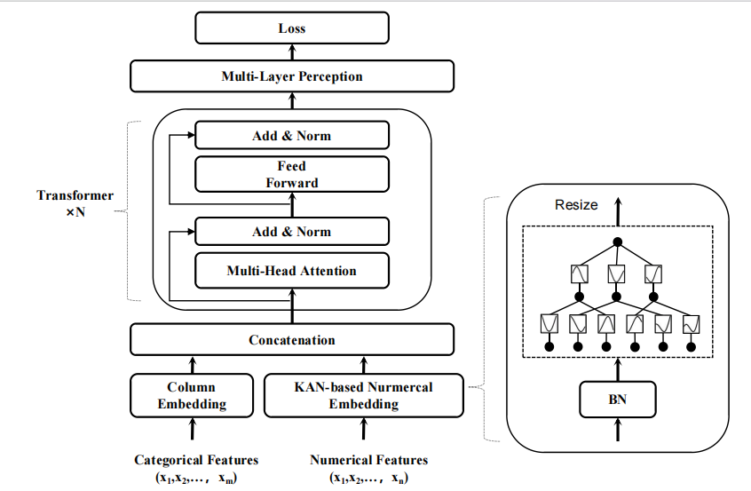
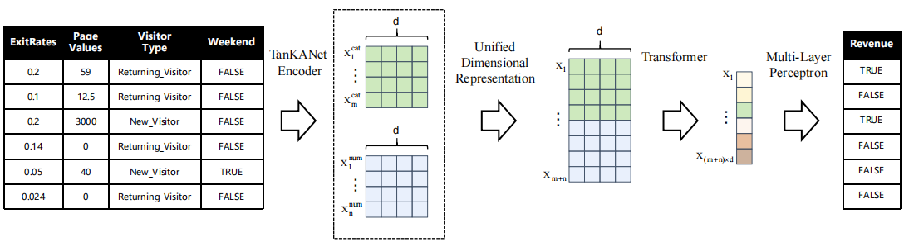

# TabKANet: Tabular Data Modeling with Kolmogorov-Arnold Network and Transformer

Table of content

- [Motivation](#motivation)
- [Modules](#modules)
- [Dataset](#dataset)
- [Usage](#usage)
- [Conclusion](#conclusion)
- [Reference](#reference)

## Motivation

**We introduce TabKANet, a novel model that leverages a KAN-based Numerical Embedding Module and Transformer to overcome neural networks' limitations in tabular data.**

## Modules

The architecture design of TabKANet

Illustration of data flow procedure in TabKANet

## Dataset

We have provided some available data in this source code, including

Online Shoppers 
https://www.openml.org/search?type=data&status=any&id=45060

Bank Marketing
https://archive.ics.uci.edu/ml/datasets/bank+marketing
                
Forest Covertype
https://www.openml.org/search?type=data&status=active&id=150
        
CA House Prices
https://www.openml.org/search?type=data&status=active&id=43705
        
Sarcos Robotics
https://www.openml.org/search?type=data&status=active&id=44976

## Usage

First, use the `templates/split_csv_5fold.py` script to split the datasets into a 5-fold cross-validation format. For example, the output will be structured as follows:

templates/cahouse/Fold1/train.csv

templates/cahouse/Fold1/val.csv

templates/cahouse/Fold1/test.csv

## Available Models

This repository includes the source code for the following models:

- XGBoost
- CatBoost
- TabNet
- TabTransformer
- MLP
- KAN
- TabKANet

## Evaluation Scripts

binary classification, multiclass and regression please run the following code:

- `catboost_binary.py`
- `catboost_multiclass.py`
- `catboost_regression.py`
- `tabnet_binary.py`
- `tabnet_multiclass.py`
- `tabnet_regression.py`
- `train_classification.py`
- `train_classification_multi.py`
- `train_regression.py`
- `xgboost_binary.py`
- `xgboost_multiclass.py`
- `xgboost_regression.py`

in

- `train_classification.py`
- `train_classification_multi.py`
- `train_regression.py`

you can choose from the following models:

- `BasicNet`
- `BasicNetKAN`
- `TabularTransformer`
- `TabKANet`

Note that `BasicNet` refers to MLP, while `BasicNetKAN` refers to the KAN network.

Additionally, for datasets that do not contain categorical features, such as the CPU dataset or the Sarcos dataset, the `TabTransformer` cannot be run.

The `run.bash` script can be used to compute all evaluation metrics for a dataset across the 5-fold cross-validation. This will generate logs of the results.

## Conclusion

In our study, we introduced TabKANet, a novel approach to table modeling that leverages a KAN-based numerical embedding module. The impressive performance of our model has been validated across a series of public tabular datasets, showcasing its advantages in terms of stability and ease of implementation. TabKANet's capability to effectively integrate information opens new probability for constructing intricate multimodal systems, potentially incorporating visual or language models. We are optimistic that TabKANet will serve as a solid foundation for future developments in table modeling, providing a versatile framework that can be expanded to address the challenges of tomorrow's data-driven landscape. Furthermore, the KAN-based numerical embedding module can be regarded as a flexible tool for enhancing the representation of numerical features in various applications.

For more details, please refer to our paper.

## Reference
