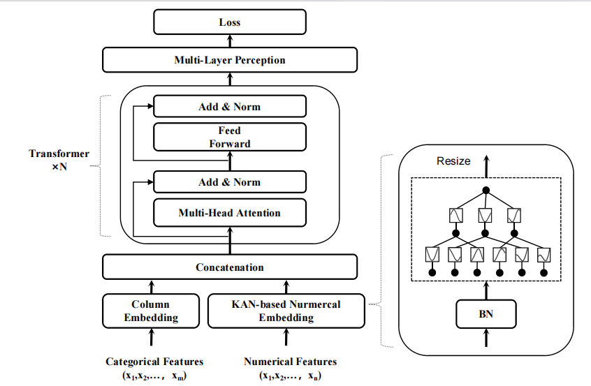
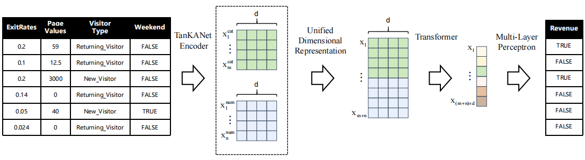

# TabKANet: Tabular Data Modeling with Kolmogorov-Arnold Network and Transformer

 The detail of the paper can be found in https://www.sciencedirect.com/science/article/pii/S0950705125017368


Table of content

- [Motivation](#motivation)
- [Modules](#modules)
- [Dataset](#dataset)
- [Usage](#usage)
- [Conclusion](#conclusion)
- [Reference](#reference)

## Motivation

**We introduce TabKANet, a novel model that leverages a KAN-based Numerical Embedding Module and Transformer to overcome neural networks' limitations in tabular data.**


## Modules



The architecture design of TabKANet



Illustration of data flow procedure in TabKANet


## Dataset

We have provided some available data in this source code, including

Online Shoppers 
https://www.openml.org/search?type=data&status=any&id=45060

Bank Marketing
https://archive.ics.uci.edu/ml/datasets/bank+marketing
                
Forest Covertype
https://www.openml.org/search?type=data&status=active&id=150
        
CA House Prices
https://www.openml.org/search?type=data&status=active&id=43705
        
Sarcos Robotics
https://www.openml.org/search?type=data&status=active&id=44976


## Usage


First, use the `templates/split_csv_5fold.py` script to split the datasets into a 5-fold cross-validation format. For example, the output will be structured as follows:

templates/cahouse/Fold1/train.csv

templates/cahouse/Fold1/val.csv

templates/cahouse/Fold1/test.csv


## Available Models

This repository includes the source code for the following models:

- XGBoost
- CatBoost
- TabNet
- TabTransformer
- MLP
- KAN
- TabKANet and TabMLPNet

## Evaluation Scripts

binary classification, multiclass and regression please run the following code:

- `catboost_binary.py`
- `catboost_multiclass.py`
- `catboost_regression.py`
- `tabnet_binary.py`
- `tabnet_multiclass.py`
- `tabnet_regression.py`
- `train_classification.py`
- `train_classification_multi.py`
- `train_regression.py`
- `xgboost_binary.py`
- `xgboost_multiclass.py`
- `xgboost_regression.py`

in

- `train_classification.py`
- `train_classification_multi.py`
- `train_regression.py`


you can choose from the following models:

- `BasicNet`
- `BasicNetKAN`
- `TabularTransformer`
- `TabKANet`

Note that `BasicNet` refers to MLP, while `BasicNetKAN` refers to the KAN network.

Additionally, for datasets that do not contain categorical features, such as the CPU dataset or the Sarcos dataset, the `TabTransformer` cannot be run.

The `run.bash` script can be used to compute all evaluation metrics for a dataset across the 5-fold cross-validation. This will generate logs of the results.


## Conclusion

In our study, we introduced TabKANet, a novel approach to table modeling that leverages a KAN-based numerical embedding module. The impressive performance of our model has been validated across a series of public tabular datasets, showcasing its advantages in terms of stability and ease of implementation. TabKANet's capability to effectively integrate information opens new probability for constructing intricate multimodal systems, potentially incorporating visual or language models. We are optimistic that TabKANet will serve as a solid foundation for future developments in table modeling, providing a versatile framework that can be expanded to address the challenges of tomorrow's data-driven landscape. Furthermore, the KAN-based numerical embedding module can be regarded as a flexible tool for enhancing the representation of numerical features in various applications.

For more details, please refer to our paper.


## Citation
If you use TabKANet in your research, please cite our Knowledge-Based Systems paper:

```bibtex
@article{GAO2025114697,
title = {Revisiting the numerical feature embeddings structure in neural network-based tabular modelling},
journal = {Knowledge-Based Systems},
volume = {330},
pages = {114697},
year = {2025},
issn = {0950-7051},
doi = {https://doi.org/10.1016/j.knosys.2025.114697},
url = {https://www.sciencedirect.com/science/article/pii/S0950705125017368},
author = {Weihao Gao and Zheng Gong and Zhuo Deng and Lan Ma},
keywords = {Tabular modeeling, Numerical feature embeddings, Kolmogorv-Arnold Network, Batch normalization, Piecewise learnable noise layer},
abstract = {Tabular data is one of the most common forms of data in real-life applications. In tabular data modelling, methods based on Gradient Boosting Decision Trees (GBDT) and neural networks have demonstrated unique advantages on different datasets. However, existing neural network methods still face bottlenecks in processing continuous numerical features. This study revisits the structural design of numerical embedding in tabular modelling based on neural networks to overcome these bottlenecks. We conceptually decouple the numerical embedding process into three core functional modules: numerical augmentation, normalization, and encoding. Based on this design, we have developed three novel models–TabMLPNet, TabKANet, and TabKANet-PLNL. These models apply batch normalization to numerical features and feed them into a single, shared Multi-Layer Perceptrons (MLP) or Kolmogorov-Arnold networks (KAN) encoder. We propose a Piecewise Learnable Noise Layer (PLNL), which enriches data representation by introducing piecewise noise into numerical features, further enhancing the model’s generalization ability. Extensive experiments on 18 public datasets demonstrate that our models achieve significant performance improvements, outperforming other neural network models. This study underscores the significant benefits of integrating Kolmogorov-Arnold Network (KAN) with batch normalization. This combination not only enables efficient normalization of numerical features, but also allows dynamic learning of numerical distributions within each batch. As a result, it effectively mitigates performance bottlenecks that are often caused by numerical skewness. Additionally, we have confirmed that introducing augmented noise during the training process can enhance the model’s feature learning capabilities. Our implementation is publicly available on GitHub and can be accessed at https://github.com/AI-thpremed/TabKANet .}
}

